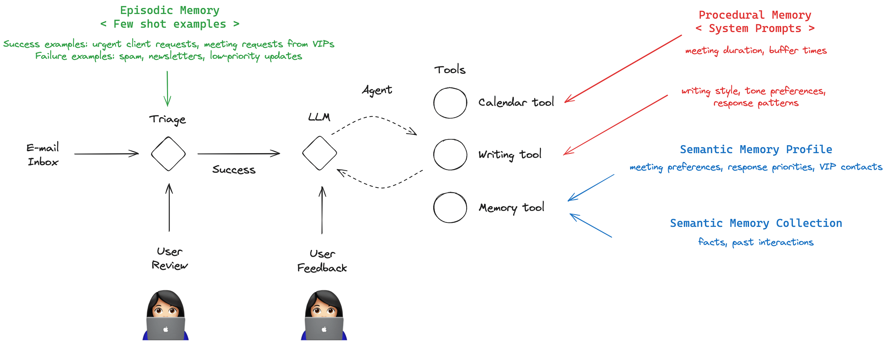

# Inspired by the course by DeepLearning.ai on Long-term Agentic Memory with langGraph

Refactored the code and added docstrings and comments as applicable

## Overview of the Agent "system/graph"

The tools have placeholders and would have to be refactored with the appropriate email/calendar Client API calls.

Using **'openai:gpt-4o-mini'** to do the intial triage and then **'anthropic:claude-3-5-sonnet-latest'** for the response agent.
